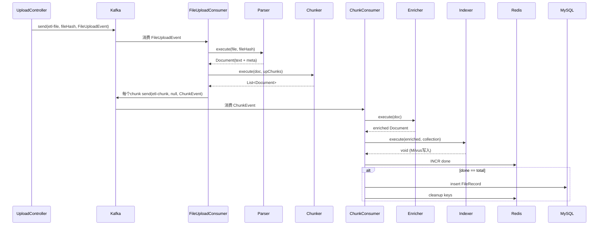
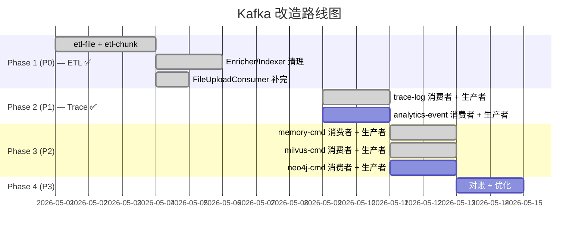

# XYAI 后端 Kafka 改造教程

> 将 XYAI 后端的异步操作与跨系统数据一致性场景改造为 Kafka 消息驱动架构。
>
> 基于 `tokafka.md` 改造计划，覆盖全部 6 个 Topic 的 **生产者** 和 **消费者** 实现。

---

## 目录

1. [架构总览](#一架构总览)
2. [改造完成度总表](#二改造完成度总表)
3. [Step 1 — Topic & 基础设施](#step-1--topic--基础设施)
4. [Step 2 — 上传 ETL（etl-file + etl-chunk）✅ 已完成](#step-2--上传-etletl-file--etl-chunk-已完成)
5. [Step 3 — ACL 权限（Redis 同步 + neo4j-cmd 清理）](#step-3--acl-权限redis-同步--neo4j-cmd-清理)
6. [Step 4 — 链路追踪（trace-log）](#step-4--链路追踪trace-log)
7. [Step 5 — 评估与计数（analytics-event）](#step-5--评估与计数analytics-event)
8. [Step 6 — 记忆持久化（memory-cmd）](#step-6--记忆持久化memory-cmd)
9. [Step 7 — Neo4j 操作（neo4j-cmd）](#step-7--neo4j-操作neo4j-cmd)
10. [Step 8 — 待改造清单](#step-8--待改造清单)
11. [Step 9 — 配置项（application.yaml）](#step-9--配置项applicationyaml)
12. [Step 10 — 测试指南](#step-10--测试指南)
13. [已删除的旧管道骨架](#已删除的旧管道骨架)
14. [附录：Topic 汇总](#附录topic-汇总)

---

## 一、架构总览

```
┌─────────────────────────────────────────────────────────────────┐
│                         UploadController                       │
│                         生产者 (send)                           │
│  etl-file ─────────────────────────────────────────┐            │
└─────────────────────────────────────────────────────┘            │
                                                                    │
         ┌──────────────────────────────────────────────────────────┘
         ▼
┌──────────────────┐     ┌──────────────────┐
│  etl-file 消费者   │     │  etl-chunk 消费者  │
│  (FileUpload)     │ ──► │  (ChunkConsumer)  │
│  Parser→Chunker   │     │  Enrich→Insert   │
└──────────────────┘     └──────────────────┘
         │                       │
         │    Redis ACL 同步操作  │（MilvusAclManager 内同步执行，不走 Kafka）
         ▼                       ▼
┌─────────────────────────────────────────────────────────────────┐
│  当 deleteDocumentAcl 判定 count<=0（唯一父级）时：              │
│  双发 milvus-cmd(删向量) + neo4j-cmd(删关系)，消费者 IdempotentChecker 保证幂等  │
└─────────────────────────────────────────────────────────────────┘

┌──────────────────┐     ┌──────────────────┐     ┌──────────────────┐
│  trace-log 消费者  │     │ analytics-event   │     │  memory-cmd 消费者 │
│  ✅ 已完成         │     │ (需新建)          │     │ (需新建)          │
│  攒批写入MySQL    │     │ 评估/计数入库     │     │  消息/摘要持久化  │
└──────────────────┘     └──────────────────┘     └──────────────────┘

┌──────────────────┐
│  neo4j-cmd 消费者  │
│  (需新建)         │
│  Milvus删向量 +   │
│  Neo4j删关系      │
└──────────────────┘
```

### Topic 设计

| Topic | 分区 | key 策略 | 用途 | 对应改造项 |
|-------|------|---------|------|-----------|
| `etl-file` | 16 | fileHash | 文件级ETL（Parse+Chunk） | A1 ✅ |
| `etl-chunk` | 8 | null（轮询） | chunk级并行（Enrich+Insert） | A1 ✅ |
| `trace-log` | 4 | 轮询 | 链路追踪写入 | A2 ✅ |
| `analytics-event` | 4 | 轮询 | 评估结果 + 使用计数 | A3, A8 |
| `memory-cmd` | 4 | conversationId | 记忆持久化 + 摘要 | A4, A5, A6 |
| `neo4j-cmd` | 4 | 轮询 | Neo4j 操作 | A7, C12 |
| `milvus-cmd` | 4 | 轮询 | Milvus 向量删除 | C3~C6 |

---

## 二、改造完成度总表

> ✅ = 已完成并可用 &nbsp; 🔶 = 部分完成（需补完） &nbsp; ❌ = 未开始 &nbsp; ⚠️ = 废弃/可删除

### 2.1 基础设施

| # | 文件 | 当前状态 | 说明 |
|---|------|---------|------|
| ✅ | `pom.xml` | 已添加 `spring-kafka` 依赖 | |
| 🔶 | `application.yaml` | 缺少 `spring.kafka.bootstrap-servers` 等配置 | 见 [Step 9](#step-9--配置项applicationyaml) |
| ✅ | `KafkaConfig.java` | 8 个 Topic + 4 个消费者工厂 | |
| ✅ | `IdempotentChecker.java` | Redis 幂等去重 | |

### 2.2 事件 POJO

| # | 文件 | 当前状态 | 说明 |
|---|------|---------|------|
| ✅ | `FileUploadEvent.java` | 文件上传事件 ✅ 已适配最新代码 | 字段: taskId, file, fileHash, collectionName, userId, eventId, upChunks |
| ✅ | `ChunkEvent.java` | chunk 处理事件 ✅ 已适配最新代码 | 字段: eventId, taskId, chunk(Document), collectionName, userId, fileName |
| ⚠️ | `ChunkResult.java` | 未使用，可删除 | 遗留在代码中无引用 |
| ⚠️ | `EnrichedChunkEvent.java` | 未使用，可删除 | 当前流程直接从 ChunkEvent 到 enrich+insert |
| ✅ | `AclCommandEvent.java` | ACL 命令事件 | |
| ✅ | `AnalyticsEvent.java` | 评估/计数事件 | |
| ✅ | `MemoryEvent.java` | 记忆持久化事件 | |
| ✅ | `Neo4jEvent.java` | Neo4j 操作事件 | |
| ✅ | `TraceLogEvent.java` | 链路追踪事件 | |

### 2.3 ETL 文件 ✅（全部已完成）

| # | 文件 | 改造项 | 状态 | 当前方法签名 |
|---|------|-------|------|-------------|
| ✅ | `Parser.java` | A1 | ✅ 已完成 | `execute(MultipartFile file, String fileHash) → Document` |
| ✅ | `Chunker.java` | A1 | ✅ 已完成 | `execute(Document document, List<Integer> upChunks) → List<Document>` |
| ✅ | `Enricher.java` | A1, A7 | ✅ 已完成 | `execute(Document chunk) → Document` |
| ✅ | `Indexer.java` | A1, C1, C2 | ✅ 已完成 | `execute(Document chunk, String collectionName) → void` |
| ✅ | `UploadController.java` | A1 | ✅ 已完成 | `processFilesInAsync` → 发 Kafka 消息 |
| ✅ | `FileUploadConsumer.java` | A1 | ✅ 已完成 | `consume(FileUploadEvent, Acknowledgment)` → Parser + Chunker + 发 ChunkEvent |
| ✅ | `ChunkConsumer.java` | A1 | ✅ 已完成 | `consume(ChunkEvent, Acknowledgment)` → Enricher + Indexer + finishFile |
| ✅ | `UploadTracker.java` | A1 | ✅ 已完成 | Redis chunk 完成跟踪器 |

### 2.4 待改造文件（非 ETL）

| # | 文件 | 改造项 | 状态 | 说明 |
|---|------|-------|------|------|
| ✅ | `TraceConsumer.java`（已创建） | A2 | ✅ 已完成 | trace-log 消费者，使用 `updateRun` 合并处理 |
| ❌ | — (需新建) `AnalyticsConsumer.java` | A3, A8 | ❌ 未开始 | analytics-event 消费者 |
| ✅ | `MemoryConsumer.java`（已创建） | A4, A5, A6 | ✅ 已完成 | memory-cmd 消费者，使用 `generateAndSaveSummary(MemoryEvent)` |
| ❌ | — (需新建) `Neo4jConsumer.java` | A7, C12 | ❌ 未开始 | neo4j-cmd 消费者 |

### 2.5 生产者改造（需发 Kafka 消息的非 ETL 类）

| # | 原类 | 目标 Topic | 状态 | 说明 |
|---|------|-----------|------|------|
| ✅ | `RagTraceAspect` | `trace-log` | ✅ 已完成 | 全部改为 `kafkaTemplate.send()`，不再使用 `traceDbExecutor` |
| ❌ | `SystemEvaluateService` | `analytics-event` | ❌ | 仍用 `evaluateExecutor` |
| ✅ | `ConversationMemorySummaryService` | `memory-cmd` | ✅ 已完成 | 已改为 `kafkaTemplate.send("memory-cmd", ...)` |
| ❌ | `MultiChannelRetrievalEngine` | `analytics-event` | ❌ | 仍直接写 DB |

> **Redis ACL 操作保持同步**：所有 Redis 权限操作（`MilvusAclManager.addFileUserACl` / `grantFileChunksToUser` / `deleteDocumentAcl` / `deleteCollectionAcl` 等）不走 Kafka，在 `MilvusAclManager` 中直接 Redis 同步执行。仅当 `deleteDocumentAcl` 判定 `singleCollection && count <= 0` 需实际清理数据时，双发 `milvus-cmd` + `neo4j-cmd` 分别执行向量删除和关系删除（消费者 `IdempotentChecker` 保证幂等）。详见 [Step 3](#step-3--acl-权限redis-同步--neo4j-cmd-清理).

---

## Step 1 — Topic & 基础设施

### 1.1 pom.xml（已添加）

```xml
<dependency>
    <groupId>org.springframework.kafka</groupId>
    <artifactId>spring-kafka</artifactId>
</dependency>
```

### 1.2 KafkaConfig.java（已完成 ✅）

定义 7 个 Topic 和 5 个消费者工厂，详见 `src/main/java/com/XYai/myai/rag/kafka/config/KafkaConfig.java`。

```java
// Topic:
etl-file (16分区) / etl-chunk (8分区)
trace-log (4分区) / analytics-event (4分区)
memory-cmd (4分区) / neo4j-cmd (4分区) / milvus-cmd (4分区)

// 消费者工厂:
defaultFactory          — 重试3次，间隔1秒
fileListenerFactory     — 重试3次，间隔1秒 (etl-file上传专用)
chunkFactory            — 重试5次，间隔2秒 (LLM调用慢)
batchListenerFactory    — 攒批写入，concurrency=2
lightRetryListenerFactory — 重试2次 (memory/neo4j/milvus)
```

### 1.3 IdempotentChecker.java（已完成 ✅）

```java
// Redis key: idempotent:{eventId}
// TTL: 24小时
public boolean isProcessed(String eventId);
public void markProcessed(String eventId);
```

所有消费者在处理消息前先调用 `isProcessed`，处理后调用 `markProcessed`，保证幂等。

---

## Step 2 — 上传 ETL（etl-file + etl-chunk）✅ 已完成

> ETL 流水线已全部改造完成，无需额外操作。
>
> 将文档上传的 **Parser → Chunker → Enricher → Indexer** 全链路改为 Kafka 消息驱动，chunk 级并行处理。

### 2.1 当前架构

```
UploadController
  └─ send(etl-file, fileHash, FileUploadEvent)   → 1ms 返回
       │
       ▼
FileUploadConsumer (etl-file 消费者, concurrency=4)
  ├─ Parser.execute(file, fileHash)       → Document
  ├─ Chunker.execute(doc, upChunks)        → List<Document>
  ├─ 每个 Document: send(etl-chunk, null, ChunkEvent)
  └─ init Redis total/done
       │
       ▼ (每个 chunk 独立)
ChunkConsumer (etl-chunk 消费者池, concurrency=8)
  ├─ Enricher.execute(doc)              → Document (含假设问题)
  ├─ Indexer.execute(doc, collection)    → Milvus 插入
  ├─ 完成计数 INCR done
  └─ 若全部完成: write FileRecord + 清理Redis
```

### 2.2 消息流



### 2.3 已修改的文件清单

| 文件 | 核心改动 |
|------|---------|
| `Parser.java` | 方法签名改为 `execute(MultipartFile, String) → Document`；改用 Jsoup 替代正则做 XHTML→Markdown；增加安全 SAX 配置 |
| `Chunker.java` | 方法签名改为 `execute(Document, List<Integer>) → List<Document>`；去掉 PipelineProperties 依赖，改用硬编码默认值；分块后直接返回，不做管道上下文操作 |
| `Enricher.java` | `execute(Document) → Document`；保留 LLM 增强逻辑（生成问题+三元组）；三元组直接写 Neo4j（未修改，保持现状） |
| `Indexer.java` | `execute(Document, String) → void`；单条 embedding + Milvus 插入；metadata 白名单过滤改用 `chunk.mutate()` |
| `UploadController.java` | `processFilesInAsync` 构建 `FileUploadEvent` → `kafkaTemplate.send("etl-file", fileHash, event)` |
| `FileUploadConsumer.java` | 消费 `etl-file`，调 Parser + Chunker → 每个 chunk 发 `ChunkEvent` |
| `ChunkConsumer.java` | 消费 `etl-chunk`，调 Enricher + Indexer → Redis 计数 → 完成时写 FileRecord |
| `UploadTracker.java` | Redis 跟踪器：`initFile()` / `completeOne()` / `isFileComplete()` / `cleanup()` |
| `FileUploadEvent.java` | 字段改为 `MultipartFile file` + `String fileHash` |
| `ChunkEvent.java` | 字段简化为 `Document chunk` + `taskId` + `collectionName` + `userId` + `fileName` |

### 2.4 ⚠️ 需要注意的问题

1. **Enricher.java** 仍写了 `implements Ingestion`，但 `Ingestion` 接口已删除，需要去掉该声明：
   ```java
   // 当前 (编译会报错):
   public class Enricher implements Ingestion {
   // 改为:
   public class Enricher {
   ```
2. **ChunkConsumer.finishFile()** 中有 TODO 注释（权限写入和事务），当前仅写 FileRecord + 清理 Redis。
3. **Indexer.java** 的 `execute()` 上仍有 `@Transactional` 注解 — 在 Kafka 消费者中不生效。

---

## Step 3 — ACL 权限（Redis 同步 + neo4j-cmd 清理）

> 🔥 **核心设计**：
> - **Milvus 只有 1 个物理集合**（`my_ai`）。所有 `collectionName` 是 **Redis 逻辑分组**，非物理 Milvus 集合。
> - **Redis ACL 操作全部同步执行**：授权/撤销/分享 等纯 Redis 操作在 `MilvusAclManager` 中同步完成，**不走 Kafka**。
> - **Kafka 仅用于真正的数据清理**：当 `deleteDocumentAcl` 判定 `singleCollection && count <= 0`（唯一父级且无其他用户引用），通过 `milvus-cmd` + `neo4j-cmd` 双 topic 分别删除向量和关系。
> - **幂等保证**：双发 `milvus-cmd` + `neo4j-cmd`，两个 topic 的消费者侧 `IdempotentChecker` 保证消息去重，重复发送安全。

---

### 3.1 架构原则

```
┌─────────────────────────────────────────────────────────────────┐
│                    Redis ACL 操作 (同步)                          │
│                                                                 │
│  MilvusAclManager 中所有方法直接在 Redis 上执行：                │
│  ├─ addFileUserACl()         → Lua SETBIT + SADD               │
│  ├─ grantFileChunksToUser()  → Lua SETBIT + INCR               │
│  ├─ deleteDocumentAcl()      → 清理位图 + DECR + 条件判断       │
│  ├─ deleteCollectionAcl()    → DECR 计数 + 清理 Set             │
│  ├─ deleteCollectionDocumentAcl() → 批量删位图                   │
│  ├─ shareFiles()             → 校验 + 委托 grantFileChunksToUser │
│  └─ ensureUserCollectionAcl()  → SADD + INCR                    │
│                                                                 │
│  所有操作同步、线性一致、不经过 Kafka                                │
└─────────────────────────────────────────────────────────────────┘
         │
         │  deleteDocumentAcl 中当 singleCollection && count<=0
         ▼
┌─────────────────────────────────────────────────────────────────┐
│             真实数据清理 (Kafka → neo4j-cmd)                      │
│                                                                 │
│  MilvusAclManager 发送 Neo4jEvent → neo4j-cmd topic             │
│                                                                 │
│  Neo4jConsumer 处理：                                            │
│  1. 删除 Milvus 向量 (deleteNoAclFileChunk 逻辑)                 │
│  2. 删除 Neo4j chunk 关系 (deleteChunkRelations)                 │
└─────────────────────────────────────────────────────────────────┘
```

### 3.2 删除决策树（来自 `deleteDocumentAcl()`）

```
用户请求删除某个文件的分块
          │
          ▼
  ┌─ file 只属于 1 个逻辑集合？ ────┐
  │ (查 file:hash Set 的大小)       │
  ├────────┬───────────────────────┤
  │  YES   │          NO           │
  │        │                       │
  ▼        │                       ▼
 清理用户位图│              只清理集合位图
   + DECR  │            (不碰计数/Milvus/Neo4j)
   count   │               文件还在其他集合中
  │        │
  ▼        │
  ┌─ count <= 0? ─┐
  ├───────┬───────┤
  │  YES  │  NO   │
  │       │       │
  ▼       │ 结束  │
  发 Kafka│       │
  → neo4j-│       │
    cmd   │       │
  ├ 删    │       │
  │ Milvus│       │
  ├ 删    │       │
  │ Neo4j │       │
  └───────┘       │
  └────────────────┘
```

### 3.3 当前代码状态（已有 Kafka 集成 ✅）

`deleteDocumentAcl()` 中，当 `singleCollection && count <= 0` 时已经发送 Kafka：

```java
// MilvusAclManager.java 第 338 行 — 已经走 Kafka ✅
kafkaTemplate.send("neo4j-cmd", null, new Neo4jEvent(
    UUID.randomUUID().toString(), "DELETE_RELATIONS",
    null, List.of(fileId + ":" + String.format("%06d", chunkId))
));
```

当前 `deleteNoAclFileChunk()`（Milvus 向量删除）仍是**同步执行**。改造目标是将 Milvus 删除也放入 Kafka 消息，与 Neo4j 删除一起在消费者中完成。

### 3.4 改造目标：将 Milvus 删除也移到 `neo4j-cmd`

#### 当前 (混合)：
```java
// 在 deleteDocumentAcl() 中，count <= 0 时：
deleteNoAclFileChunk(fileId, chunkId);           // ← 同步 Milvus 删除

kafkaTemplate.send("neo4j-cmd", null,
    new Neo4jEvent(..., "DELETE_RELATIONS", ...)); // ← 异步 Neo4j 删除
```

#### 改造后（全部异步）：

```java
// 在 deleteDocumentAcl() 中，count <= 0 时：
// 不再同步调用 deleteNoAclFileChunk
// 仅发送一条 Kafka 消息，消费者同时做 Milvus + Neo4j 删除
kafkaTemplate.send("neo4j-cmd", null,
    new Neo4jEvent(..., "DELETE_CHUNK",
        fileId, chunkId, collectionName));
```

**Neo4jEvent 扩展字段**（新增 `fileId`, `chunkId`, `collectionName`）：

```java
@Data @NoArgsConstructor @AllArgsConstructor
public class Neo4jEvent {
    private String eventId;
    private String commandType;    // INSERT_TRIPLES, DELETE_RELATIONS,
                                   // DELETE_CHUNK (新增: 同时删 Milvus + Neo4j),
                                   // TRIGGER_MAINTENANCE
    private String triplesJson;    // 三元组JSON
    private java.util.List<String> chunkIds;  // 旧字段，DELETE_RELATIONS 用
    // ↓ 新增字段，DELETE_CHUNK 用
    private String fileId;         // 文件哈希ID
    private Integer chunkId;       // 分块序号
    private String collectionName; // 逻辑集合名
}
```

### 3.5 改造内容清单

#### 要改的文件（2 个）

| # | 文件 | 改动 |
|---|------|------|
| 1 | `MilvusAclManager.java` | `deleteDocumentAcl()` 中 `count <= 0` 时：移除 `deleteNoAclFileChunk()` 同步调用；扩展 `Neo4jEvent` 发送内容，增加 fileId/chunkId |
| 2 | `Neo4jConsumer.java`（需新建或修改） | 新增 `DELETE_CHUNK` commandType 处理：先删 Milvus 向量，再删 Neo4j 关系 |

#### 保持不变（不改）

| # | 类/方法 | 原因 |
|---|---------|------|
| `MilvusAclManager.addFileUserACl()` | 纯 Redis 操作，同步执行 |
| `MilvusAclManager.grantFileChunksToUser()` | 纯 Redis 操作，同步执行 |
| `MilvusAclManager.deleteCollectionAcl()` | 纯 Redis 操作，同步执行 |
| `MilvusAclManager.deleteCollectionDocumentAcl()` | 纯 Redis 操作，同步执行 |
| `MilvusCollectionManager.drop()` | 纯 Redis 操作，同步执行 |
| `MilvusCollectionManager.rebuild()` | 纯 Redis 操作，同步执行 |
| `MilvusFileManager.shareFiles()` | 纯 Redis 操作，同步执行 |
| `MilvusAclManager.getUserCollectionsAcl()` | 只读，必须同步 |
| `MilvusAclManager.getCollectionAcl()` | 只读，必须同步 |
| `MilvusAclManager.getFileAcl()` | 只读，必须同步 |

### 3.6 生产者改造：deleteDocumentAcl

```java
// ═══ 当前：同步 Milvus + 异步 Neo4j（已部分 Kafka）═══
// deleteDocumentAcl() 中 count <= 0 时：
deleteNoAclFileChunk(fileId, chunkId);  // ← 同步，要改掉

kafkaTemplate.send("neo4j-cmd", null, new Neo4jEvent(
    UUID.randomUUID().toString(), "DELETE_RELATIONS",
    null, List.of(fileId + ":" + String.format("%06d", chunkId))
));

// ═══ 改造后：全部异步（一条 Kafka 消息触发 Milvus + Neo4j）═══
kafkaTemplate.send("neo4j-cmd", null, new Neo4jEvent(
    UUID.randomUUID().toString(), "DELETE_CHUNK",
    null, null,                     // triplesJson, chunkIds 用不到
    fileId, chunkId, collectionName  // 新增字段
));
```

### 3.7 消费者改造：Neo4jConsumer 处理 DELETE_CHUNK

```java
// Neo4jConsumer.java — 新增 commandType 处理

@Resource
private MilvusClient milvusClient;  // 新增 Milvus 客户端注入

@Value("${spring.ai.vectorstore.milvus.databaseName:my_xy}")
private String databaseName;

@Value("${spring.ai.vectorstore.milvus.collectionName:my_ai}")
private String physicalCollectionName;

private void handleDeleteChunk(Neo4jEvent event) {
    // 1. 删除 Milvus 向量（原 deleteNoAclFileChunk 逻辑）
    String expectedId = event.getFileId() + ":" + String.format("%06d", event.getChunkId());
    String expr = String.format("doc_id == \"%s\"", expectedId);
    try {
        milvusClient.delete(DeleteParam.newBuilder()
            .withDatabaseName(databaseName)
            .withCollectionName(physicalCollectionName)
            .withExpr(expr)
            .build());
        log.info("Milvus向量已删除: doc_id={}", expectedId);
    } catch (Exception e) {
        log.error("Milvus向量删除失败: doc_id={}", expectedId, e);
        throw e;  // 让 Kafka 重试
    }

    // 2. 删除 Neo4j 关系（复用现有逻辑）
    neo4jKnowledgeGraphService.deleteChunkRelations(
        Set.of(expectedId));
}
```

### 3.8 小结：这条链路无需 `acl-cmd` topic

```
                   Redis ACL 操作（全部同步）
                   ┌──────────────────────────────┐
                   │ MilvusAclManager              │
                   │  ├─ addFileUserACl()          │
                   │  ├─ deleteDocumentAcl()       │
                   │  ├─ deleteCollectionAcl()     │
                   │  └─ grantFileChunksToUser()   │
                   └──────────────────────────────┘
                              │
                   count <= 0 │ （唯一父级，该删了）
                              ▼
                   Kafka → neo4j-cmd topic
                              │
                              ▼
                   ┌──────────────────────────────┐
                   │ Neo4jConsumer                 │
                   │  ├─ DELETE_CHUNK → Milvus 删  │
                   │  └─ DELETE_CHUNK → Neo4j 删   │
                   └──────────────────────────────┘
```

这条设计不需要 `acl-cmd` topic。所有 Redis 权限操作保持简单同步，Kafka 仅用于跨系统的真实数据清理。

---


## Step 4 — 链路追踪（trace-log）✅ 已完成

### 4.1 所属改造项

| 编号 | 位置 | 描述 |
|------|------|------|
| A2 | `RagTraceAspect` (15+ 调用点) | @RagTraceNode 拦截写链路追踪到 MySQL |

### 4.2 事件定义（已完成 ✅）

```java
// TraceLogEvent.java
public class TraceLogEvent {
    private String eventId;
    private String traceId;
    private String nodeId;         // null 表示 run 级事件，非 null 表示 node 级事件
    private String nodeName;
    private String eventType;     // start, finish, error, warn,
                                  // node, node_success, node_warn, node_error
    private String message;
    private Long costNanos;       // 单位: 毫秒
    private Long timestamp;
    private Long userId;
}
```

### 4.3 生产者 — RagTraceAspect（已改造 ✅）

当前 `RagTraceAspect` 的全部 `traceDbExecutor.execute()` 都已被替换为 `kafkaTemplate.send()`。

**改造要点**：

| 位置 | 原调用 | 现发送 eventType |
|------|--------|-----------------|
| `aroundRoot` 入口 | `traceRecordService.startRun()` | `"start"` |
| `aroundRoot` 同步成功 | `traceRecordService.finishRun()` | `"finish"` + costNanos |
| `aroundRoot` 同步警告 | `traceRecordService.recordRunWarn()` | `"warn"` + message + costNanos |
| `aroundRoot` CompletableFuture 异常 | `traceRecordService.recordError()` | `"error"` + message |
| `aroundRoot` CompletableFuture 成功/警告 | 同上同步 | `"finish"` / `"warn"` |
| `aroundNode` 入口 | `traceRecordService.recordNode()` | `"node"` + nodeId + nodeName |
| `aroundNode` 同步完成 | `traceRecordService.updateNode()` | `"node_success"` / `"node_warn"` |
| `aroundNode` 异常 | `traceRecordService.recordNodeError()` | `"node_error"` + message |
| wrapCompletableFutureNode / wrapMonoNode / wrapFluxNode | `traceRecordService.updateNode()` / `recordNodeWarn()` / `recordNodeError()` | `"node_success"` / `"node_warn"` / `"node_error"` |

### 4.4 TraceRecordService — 合并 updateRun（已完成 ✅）

在接口中新增统一更新方法，原有的 `finishRun` / `recordError` / `recordRunWarn` 全部委托给 `updateRun`：

```java
// TraceRecordService.java
void updateRun(String traceId, String status, String message, Long costTimeMs);

// TraceRecordServiceIml.java
@Override
public void updateRun(String traceId, String status, String message, Long costTimeMs) {
    traceRecordMapper.updateByTraceId(traceId, status, LocalDateTime.now(), costTimeMs, message);
}

// 原有方法委托给 updateRun:
finishRun → updateRun(traceId, "SUCCESS", null, costTime)
recordError → updateRun(traceId, "ERROR", message, null)
recordRunWarn → updateRun(traceId, "WARN", warnMessage, costTime)
```

### 4.5 消费者实现（已创建 ✅ — 攒批写入）

```java
// TraceConsumer.java
@Component
@Slf4j
public class TraceConsumer {

    @Resource
    private TraceRecordService traceRecordService;

    @KafkaListener(topics = "trace-log", groupId = "xyai-trace",
            containerFactory = "batchListenerFactory")  // 攒批
    public void consume(List<TraceLogEvent> events, Acknowledgment ack) {
        try {
            for (TraceLogEvent event : events) {
                switch (event.getEventType()) {
                    // ─── Run 级事件（traceRecord 表）───
                    case "start" -> traceRecordService.startRun(
                            event.getTraceId(), event.getNodeName());
                    case "finish" -> traceRecordService.updateRun(
                            event.getTraceId(), "SUCCESS", null, event.getCostNanos());
                    case "error" -> traceRecordService.updateRun(
                            event.getTraceId(), "ERROR", event.getMessage(), null);
                    case "warn" -> traceRecordService.updateRun(
                            event.getTraceId(), "WARN", event.getMessage(), event.getCostNanos());

                    // ─── Node 级事件（node_record 表）───
                    case "node" -> traceRecordService.recordNode(
                            event.getTraceId(), event.getNodeId(), event.getNodeName(), event.getMessage());
                    case "node_success" -> traceRecordService.updateNode(
                            event.getTraceId(), "SUCCESS", event.getNodeId(),
                            event.getNodeName(), null, event.getCostNanos(), null);
                    case "node_warn" -> traceRecordService.updateNode(
                            event.getTraceId(), "WARN", event.getNodeId(),
                            event.getNodeName(), null, event.getCostNanos(), event.getMessage());
                    case "node_error" -> traceRecordService.updateNode(
                            event.getTraceId(), "ERROR", event.getNodeId(),
                            event.getNodeName(), null, null, event.getMessage());
                }
            }
            ack.acknowledge();
        } catch (Exception e) {
            log.error("Trace消费失败", e);
            throw new RuntimeException(e);
        }
    }
}
```

---

## Step 5 — 评估与计数（analytics-event）

## Step 5 — 评估与计数（analytics-event）

### 5.1 所属改造项

| 编号 | 位置 | 描述 |
|------|------|------|
| A3 | `SystemEvaluateService.submitEvaluate` | LLM 评估+规则评估+评分入库 |
| A8 | `MultiChannelRetrievalEngine.incrementFileChunkCount` | 检索使用次数 +1 |

### 5.2 事件定义（已完成 ✅）

```java
// AnalyticsEvent.java
public class AnalyticsEvent {
    private String eventId;
    private String eventType;    // evaluate, use_count
    private Long conversationId;
    private Long messageId;
    private Long userId;
    private String chunkId;
    private Double score;
    private String modelName;
}
```

### 5.3 生产者改造

**SystemEvaluateService**：

```java
// 旧：
CompletableFuture.runAsync(() -> {
    EvaluateResult result = evaluate(message, chunks, latencyMs, userQuestion, conversationId);
    systemEvaluateMapper.insert(record);
}, evaluateExecutor);

// 新：
kafkaTemplate.send("analytics-event", null, new AnalyticsEvent(
    UUID.randomUUID().toString(),
    "evaluate",
    conversationId, messageId, userId,
    null, overallScore, modelName
));
```

**MultiChannelRetrievalEngine**：

```java
// 旧：
CompletableFuture.runAsync(() -> incrementFileChunkCount(chunk.getId()), searchChannelExecutor);

// 新：
kafkaTemplate.send("analytics-event", null, new AnalyticsEvent(
    UUID.randomUUID().toString(),
    "use_count",
    null, null, null,
    chunk.getId(), null, null
));
```

### 5.4 消费者实现（新建 ❌）

```java
@Component
@Slf4j
public class AnalyticsConsumer {

    @Resource
    private SystemEvaluateMapper systemEvaluateMapper;
    @Resource
    private FileRecordMapper fileRecordMapper;

    @KafkaListener(topics = "analytics-event", groupId = "xyai-analytics",
            containerFactory = "batchListenerFactory")
    public void consume(List<AnalyticsEvent> events, Acknowledgment ack) {
        try {
            for (AnalyticsEvent event : events) {
                switch (event.getEventType()) {
                    case "evaluate" -> handleEvaluate(event);
                    case "use_count" -> handleUseCount(event);
                }
            }
            ack.acknowledge();
        } catch (Exception e) {
            log.error("Analytics消费失败", e);
            throw new RuntimeException(e);
        }
    }
}
```

---

## Step 6 — 记忆持久化（memory-cmd）

### 6.1 所属改造项

| 编号 | 位置 | 描述 |
|------|------|------|
| A4 | `ConversationMemorySummaryService.doCompressIfNeeded` | 检查阈值+触发压缩 |
| A5 | `ConversationMemorySummaryService.saveMessage` | 保存聊天消息到 MySQL |
| A6 | `ConversationMemorySummaryService.generateAndSaveSummary` | LLM 摘要+存 Redis+存 DB |

### 6.2 事件定义（已完成 ✅）

```java
// MemoryEvent.java
public class MemoryEvent {
    private String eventId;
    private String commandType;  // SAVE_MESSAGE, COMPRESS, GENERATE_SUMMARY
    private Long conversationId;
    private Long userId;
    private String messageJson;
}
```

### 6.3 生产者改造

**ConversationMemorySummaryService 中的调用点**：

```java
// 在 compressIfNeeded 中：
// 旧: memoryCompactExecutor.execute(() -> doCompressIfNeeded(...))
// 新:
kafkaTemplate.send("memory-cmd", String.valueOf(conversationId),
    new MemoryEvent(UUID.randomUUID().toString(), "COMPRESS",
        conversationId, userId, JSON.toJSONString(message)));

// 在 asyncSaveToDatabase 中：
// 旧: memoryCompactExecutor.execute(() -> saveOrUpdateSessionRecord(...))
// 新:
kafkaTemplate.send("memory-cmd", String.valueOf(conversationId),
    new MemoryEvent(UUID.randomUUID().toString(), "SAVE_MESSAGE",
        conversationId, userId, JSON.toJSONString(message)));

// 在 generateAndSaveSummary 中：
// 旧: summaryExecutor.execute(() -> generateSummary(...))
// 新:
kafkaTemplate.send("memory-cmd", String.valueOf(conversationId),
    new MemoryEvent(UUID.randomUUID().toString(), "GENERATE_SUMMARY",
        conversationId, userId, summaryJson));
```

### 6.4 消费者实现（新建 ❌）

```java
@Component
@Slf4j
public class MemoryConsumer {

    @Resource
    private ChatSessionRecordMapper chatSessionRecordMapper;
    @Resource
    private ChatConversationMapper chatConversationMapper;

    @KafkaListener(topics = "memory-cmd", groupId = "xyai-memory",
            concurrency = "2", containerFactory = "lightRetryListenerFactory")
    public void consume(MemoryEvent event, Acknowledgment ack) {
        // 幂等检查 + 处理
        switch (event.getCommandType()) {
            case "SAVE_MESSAGE" -> saveMessage(event);
            case "COMPRESS" -> compress(event);
            case "GENERATE_SUMMARY" -> generateSummary(event);
        }
        ack.acknowledge();
    }
}
```

---

## Step 7 — Neo4j 操作（neo4j-cmd）

### 7.1 所属改造项

| 编号 | 位置 | 描述 |
|------|------|------|
| A7 | Enricher→batchInsertTriples | LLM 富化后写 Neo4j |
| C12 | `Neo4jKnowledgeGraphService.deleteChunkRelations` | 删文件时清理 Neo4j 关系 |

### 7.2 事件定义（已完成 ✅）

```java
// Neo4jEvent.java
public class Neo4jEvent {
    private String eventId;
    private String commandType;   // INSERT_TRIPLES, DELETE_RELATIONS, TRIGGER_MAINTENANCE
    private String triplesJson;
    private List<String> chunkIds;
}
```

### 7.3 生产者改造

**在 Enricher 中**（当前仍直接调用 Neo4j，可改为发消息）：

```java
// 旧：在 enrichChunk 里收集 triplesMap，execute 最后批量写入 Neo4j
// 当前：Enricher.execute() 仍直接调用 neo4jKnowledgeGraphService.batchInsertTriples()
// 可改为：将三元组发到 neo4j-cmd topic
```

**在 MilvusAclManager.deleteDocumentAcl 中**：

```java
// 旧：直接调用 neo4jKnowledgeGraphService.deleteChunkRelations(...)
// 新：发 neo4j-cmd 消息
kafkaTemplate.send("neo4j-cmd", null, new Neo4jEvent(
    UUID.randomUUID().toString(), "DELETE_RELATIONS",
    null, List.of(fileId + ":" + String.format("%06d", chunkId))
));
```

### 7.4 消费者实现（新建 ❌）

```java
@Component
@Slf4j
public class Neo4jConsumer {

    @Resource
    private Neo4jKnowledgeGraphService neo4jService;

    @KafkaListener(topics = "neo4j-cmd", groupId = "xyai-neo4j",
            concurrency = "2", containerFactory = "lightRetryListenerFactory")
    public void consume(Neo4jEvent event, Acknowledgment ack) {
        if (idempotentChecker.isProcessed(event.getEventId())) {
            ack.acknowledge();
            return;
        }
        try {
            switch (event.getCommandType()) {
                case "INSERT_TRIPLES" -> {
                    Map<String, String> triples = parseTriples(event.getTriplesJson());
                    neo4jService.batchInsertTriples(triples);
                }
                case "DELETE_RELATIONS" ->
                    neo4jService.deleteChunkRelations(new HashSet<>(event.getChunkIds()));
                case "TRIGGER_MAINTENANCE" ->
                    neo4jService.triggerCommunityMaintenanceIfNeeded();
            }
            idempotentChecker.markProcessed(event.getEventId());
            ack.acknowledge();
        } catch (Exception e) {
            log.error("Neo4j操作失败", e);
            throw new RuntimeException(e);
        }
    }
}
```

---

## Step 8 — 待改造清单

### 8.1 需要新建的消费者类（5 个）

| 类名 | Topic | 建议位置 | 优先级 |
|------|-------|---------|--------|
| ✅ `TraceConsumer.java` | trace-log | `rag/kafka/consumer/` | ✅ 已完成 |
| `AnalyticsConsumer.java` | analytics-event | `rag/kafka/consumer/` | P1 |
| ✅ `MemoryConsumer.java` | memory-cmd | `rag/kafka/consumer/` | ✅ 已完成 |
| `Neo4jConsumer.java` | neo4j-cmd | `rag/kafka/consumer/` | P2 |

> **注意**：Redis ACL 操作无需消费者。`acl-cmd` topic 已被移除。`Neo4jConsumer` 需扩展处理 `DELETE_CHUNK` 命令（Milvus + Neo4j 清理）。

建议统一放在 `src/main/java/com/XYai/myai/rag/kafka/consumer/` 目录下。

### 8.2 ETL 遗留小问题（不影响功能）

| 问题 | 文件 | 建议 |
|------|------|------|
| `implements Ingestion` 残留（接口已删） | `Enricher.java` | 删除 `implements Ingestion` |
| `@Transactional` 在 Kafka 消费者中不生效 | `Indexer.java` | 删除该注解 |
| `finishFile()` 中有 TODO 注释 | `ChunkConsumer.java` | 根据需求补充 ACL 写入 |

### 8.3 需要改造的生产者（8 处，非 ETL）

| # | 类 | 改造成发 Kafka 消息 |
|---|------|-------------------|
| ✅ 1 | `RagTraceAspect.java` | 已完成 — `kafkaTemplate.send("trace-log", ...)` 覆盖全部 15+ 调用点，含 node 级事件 |
| 2 | `SystemEvaluateService.java` | `CompletableFuture.runAsync(..., evaluateExecutor)` → `kafkaTemplate.send("analytics-event", ...)` |
| ✅ 3 | `ConversationMemorySummaryService.java` | 已完成 — 改为 `kafkaTemplate.send("memory-cmd", ...)` (COMPRESS / GENERATE_SUMMARY) |
| 4 | `MultiChannelRetrievalEngine.java` | `CompletableFuture.runAsync(() -> incrementFileChunkCount(...))` → `kafkaTemplate.send("analytics-event", ...)` |
| ✅ 5 | `MilvusAclManager.java` | 已完成 — 双发 `milvus-cmd` + `neo4j-cmd`，消费者的 IdempotentChecker 保证幂等 |

> **Redis ACL 操作不走 Kafka**：`addFileUserACl` / `grantFileChunksToUser` / `deleteCollectionAcl` / `deleteCollectionDocumentAcl` / `MilvusCollectionManager.drop/rebuild` / `MilvusFileManager.shareFiles` — 全部保持同步 Redis 操作，不改动。

---

## Step 9 — 配置项（application.yaml）

需要新增以下 Kafka 配置：

```yaml
spring:
  kafka:
    bootstrap-servers: localhost:9092     # 根据实际环境修改
    producer:
      # KafkaConfig 中已程序化配置 JsonSerializer，无需 yaml 配置
      key-serializer: org.apache.kafka.common.serialization.StringSerializer
      value-serializer: org.springframework.kafka.support.serializer.JsonSerializer
      properties:
        spring.json.type.mapping: >
          fileUploadEvent:com.XYai.myai.rag.kafka.event.FileUploadEvent,
          chunkEvent:com.XYai.myai.rag.kafka.event.ChunkEvent,
          aclCommandEvent:com.XYai.myai.rag.kafka.event.AclCommandEvent,
          analyticsEvent:com.XYai.myai.rag.kafka.event.AnalyticsEvent,
          memoryEvent:com.XYai.myai.rag.kafka.event.MemoryEvent,
          neo4jEvent:com.XYai.myai.rag.kafka.event.Neo4jEvent,
          traceLogEvent:com.XYai.myai.rag.kafka.event.TraceLogEvent
    consumer:
      group-id: xyai-default
      key-deserializer: org.apache.kafka.common.serialization.StringDeserializer
      value-deserializer: org.springframework.kafka.support.serializer.JsonDeserializer
      properties:
        spring.json.type.mapping: >
          com.XYai.myai.rag.kafka.event.FileUploadEvent:fileUploadEvent,
          com.XYai.myai.rag.kafka.event.ChunkEvent:chunkEvent,
          com.XYai.myai.rag.kafka.event.AclCommandEvent:aclCommandEvent,
          com.XYai.myai.rag.kafka.event.AnalyticsEvent:analyticsEvent,
          com.XYai.myai.rag.kafka.event.MemoryEvent:memoryEvent,
          com.XYai.myai.rag.kafka.event.Neo4jEvent:neo4jEvent,
          com.XYai.myai.rag.kafka.event.TraceLogEvent:traceLogEvent
        spring.json.trusted.packages: "*"
      enable-auto-commit: false
      auto-offset-reset: earliest
    listener:
      ack-mode: manual
```

> **⚠️ 注意**：确保 `spring.json.type.mapping` 中 producer 和 consumer 的 mapping 方向相反。Producer 侧是 `逻辑名:全限定类名`，Consumer 侧是 `全限定类名:逻辑名`。

---

## 已删除的旧管道骨架

以下类已在之前的重构中删除，不再需要：

| 文件 | 说明 |
|------|------|
| `Ingestion.java` | 旧管道节点接口 |
| `IngestionContext.java` | 旧管道上下文 |
| `NodeConfig.java` | 旧节点配置 |
| `NodeResult.java` | 旧节点结果 |
| `IngestionEngine.java` | 旧管道执行引擎 |
| `PipelineDefinition.java` | 旧管道定义 |
| `PipelineDefinitionFactory.java` | 旧管道工厂 |
| `UploadIngestionContextFactory.java` | 旧上传上下文工厂 |
| `ConditionEvaluator.java` | 旧条件评估器 |
| `NodeLog.java` | 旧节点日志 |

---

## 附录：Topic 汇总

### Topic 一览

```
etl-file (16分区)     组: xyai-ingest     消费者: FileUploadConsumer    ✅ 已完成
etl-chunk (8分区)     组: xyai-etl-chunk  消费者: ChunkConsumer         ✅ 已完成
trace-log (4分区)     组: xyai-trace      消费者: TraceConsumer         ✅ 已完成
analytics-event (4分区)组: xyai-analytics 消费者: AnalyticsConsumer     ❌ 需新建
memory-cmd (4分区)    组: xyai-memory     消费者: MemoryConsumer        ✅ 已完成
neo4j-cmd (4分区)     组: xyai-neo4j      消费者: Neo4jConsumer         ❌ 需新建
milvus-cmd (4分区)    组: xyai-milvus     消费者: MilvusConsumer        ✅ 已完成

> **注意**：`acl-cmd` topic 已被移除。Redis ACL 操作全部同步执行，不走 Kafka。
```

### 消息格式

| Topic | 消息类 | key | 保留期 | 说明 |
|-------|--------|-----|--------|------|
| etl-file | `FileUploadEvent` | fileHash | 7天 | 同一文件串行处理 ✅ |
| etl-chunk | `ChunkEvent` | null | 7天 | chunk 级并行 ✅ |
| trace-log | `TraceLogEvent` | null | 3天 | 链路追踪 ✅ |
| analytics-event | `AnalyticsEvent` | null | 3天 | 评估+计数 ❌ |
| memory-cmd | `MemoryEvent` | conversationId | 3天 | 记忆操作顺序 ✅ |
| neo4j-cmd | `Neo4jEvent` | null | 3天 | Neo4j 关系清理 ❌ |
| milvus-cmd | `MilvusEvent` | null | 3天 | Milvus 向量删除 ✅ |

> **注意**：Redis ACL 操作不走 Kafka，无需 topic。

---

## 改造路线图



---

## 修改对照总结

### ETL 部分 — 已完成 ✅

#### 已修改（8 个）
| 文件 | 状态 |
|------|------|
| `UploadController.java` | ✅ |
| `Parser.java` | ✅ |
| `Chunker.java` | ✅ |
| `Enricher.java` | ✅ |
| `Indexer.java` | ✅ |
| `FileUploadConsumer.java` | ✅ |
| `ChunkConsumer.java` | ✅ |
| `UploadTracker.java` | ✅ |

#### 已适配事件类（2 个）
| 文件 | 状态 |
|------|------|
| `FileUploadEvent.java` | ✅ 字段已同步为 MultipartFile + fileHash |
| `ChunkEvent.java` | ✅ 字段已简化为 Document chunk |

### 非 ETL 部分 — 已完成 ✅ 与待改造

#### 已完成
- `RagTraceAspect.java` ✅ — 全部改为 Kafka 发送
- `TraceConsumer.java` ✅ — 已创建，使用 `updateRun` 合并处理
- `TraceRecordService.updateRun()` ✅ — 新增方法，`finishRun`/`recordError`/`recordRunWarn` 委托给 `updateRun`
- `ConversationMemorySummaryService.java` ✅ — 改为发送 `memory-cmd` 消息
- `MemoryConsumer.java` ✅ — 已创建，处理 SAVE_MESSAGE / COMPRESS / GENERATE_SUMMARY
- `MemoryEvent.java` ✅ — 字段改为 `messageJson` (String)，支持所有命令类型
- `MilvusEvent.java` ✅ — 新增，Milvus 向量删除事件
- `MilvusConsumer.java` ✅ — 已创建，处理 DELETE_CHUNK
- `deleteDocumentAcl()` ✅ — 双发 `milvus-cmd` + `neo4j-cmd`，消费者 IdempotentChecker 保证幂等

#### Redis ACL 操作（保持同步，不走 Kafka）
`MilvusAclManager` / `MilvusCollectionManager` / `MilvusFileManager` 中所有 Redis 权限操作保持同步：
- `addFileUserACl()` / `grantFileChunksToUser()` / `setUserFileChunks()`
- `deleteCollectionAcl()` / `deleteCollectionDocumentAcl()`
- `MilvusCollectionManager.drop()` / `rebuild()`
- `MilvusFileManager.shareFiles()`

仅 `deleteDocumentAcl()` 中 `count<=0` 时触发真实清理 → 双发 `milvus-cmd` + `neo4j-cmd`。

#### 待改造

##### 需新建消费者（1 个）
- `AnalyticsConsumer.java` ❌

#### 遗留小修复
- `Enricher.java` — 去掉残留的 `implements Ingestion`
- `Indexer.java` — 去掉 `@Transactional` 注解

#### 已删除（10 个旧类）
`Ingestion.java`, `IngestionContext.java`, `NodeConfig.java`, `NodeResult.java`, `IngestionEngine.java`, `PipelineDefinition.java`, `PipelineDefinitionFactory.java`, `UploadIngestionContextFactory.java`, `ConditionEvaluator.java`, `NodeLog.java`

---

## Step 10 — 测试指南

> 验证 Kafka 改造后的各管道是否正常工作。

---

### 10.1 前置检查

```bash
# 1. 确保 Kafka 已启动（docker-compose 方式）
docker-compose up -d

# 2. 检查 topic 是否自动创建
docker exec -it <kafka-container> kafka-topics.sh --list --bootstrap-server localhost:9092

# 预期输出：
#   etl-file
#   etl-chunk
#   trace-log
#   memory-cmd
#   neo4j-cmd
#   milvus-cmd
#   analytics-event

# 3. 检查 application.yaml 配置
#    确保以下配置已存在：
#    KafkaConfig 中已程序化配置，无需 yaml 额外配置
#    spring.kafka.producer.properties.enable.idempotence=true
#    spring.kafka.consumer.enable-auto-commit=false
#    spring.kafka.listener.ack-mode=manual
```

---

### 10.2 测试 ETL 上传管道

#### 测试场景

上传一个文件，验证它经过 `etl-file` → `etl-chunk` 两个 topic 完成全流程。

#### 测试步骤

```bash
# Step 1: 上传文件（替换为真实 token 和文件）
curl -X POST http://localhost:8080/upload/up \
  -H "Authorization: Bearer <token>" \
  -F "file=@test.pdf" \
  -F "collectionName=test_collection"

# 返回示例：{"code":200,"data":"<taskId>","msg":"success"}
```

```bash
# Step 2: 监控 etl-file topic（验证 Parser + Chunker 是否执行）
docker exec -it <kafka-container> kafka-console-consumer.sh \
  --bootstrap-server localhost:9092 \
  --topic etl-file \
  --group test-group \
  --from-beginning \
  --max-messages 1

# 预期：看到 FileUploadEvent JSON，包含 taskId / file / fileHash / collectionName
```

```bash
# Step 3: 监控 etl-chunk topic（验证 Enricher + Indexer 是否执行）
docker exec -it <kafka-container> kafka-console-consumer.sh \
  --bootstrap-server localhost:9092 \
  --topic etl-chunk \
  --group test-group \
  --from-beginning \
  --max-messages 3

# 预期：看到多条 ChunkEvent JSON，每条包含一个 Document chunk
```

#### 验证结果

```bash
# 查询上传任务状态
curl http://localhost:8080/upload/task?taskId=<taskId>

# 预期状态：SUCCESS
```

| 检查项 | 方法 | 预期结果 |
|--------|------|---------|
| Redis UploadTracker | `GET upload:{taskId}:total` / `GET upload:{taskId}:done` | 相等且 1 小时后自动过期 |
| MySQL FileRecord | `SELECT * FROM file_record WHERE file_chunk_id LIKE '{taskId}%'` | 有对应记录 |
| Milvus 向量 | 通过 Attu 或 API 查询 `my_ai` collection | 有 `doc_id` 为 `{taskId}:000001` 的数据 |
| Redis ACL | `GETBIT xyai:user:filebits:{fileId}:{userId}` | chunk 对应位为 1 |
| Redis ACL | `SMEMBERS xyai:collection:files:{collectionName}` | 包含 `{fileId}:{chunkSize}` |

---

### 10.3 测试 trace-log 链路追踪

#### 测试场景

发起一次对话，验证所有 `@RagTraceNode` / `@RagTraceRoot` 注解的方法都通过 `trace-log` topic 发送追踪记录。

#### 测试步骤

```bash
# Step 1: 发起对话（替换为真实 token）
curl -X POST http://localhost:8080/ai/chat \
  -H "Authorization: Bearer <token>" \
  -H "Content-Type: application/json" \
  -d '{"message":"你好","conversationId":null}'
```

```bash
# Step 2: 监控 trace-log topic（批量消费，使用 batchListenerFactory）
docker exec -it <kafka-container> kafka-console-consumer.sh \
  --bootstrap-server localhost:9092 \
  --topic trace-log \
  --group test-trace \
  --from-beginning \
  --max-messages 10

# 预期看到的事件类型（按顺序）：
#   start     — 根流程开始 (aroundRoot)
#   node      — 各个 @RagTraceNode 开始
#   node_success — 各节点完成
#   finish    — 根流程完成
# 或：
#   error     — 根流程异常
#   warn      — 根流程警告
```

#### 验证结果

```bash
# 查 MySQL（TraceRecord 表记录根流程，NodeRecord 表记录各节点）
SELECT trace_id, name, status, start_time, end_time
FROM trace_record
ORDER BY start_time DESC
LIMIT 5;
```

| 检查项 | 预期 |
|--------|------|
| TraceRecord 表 | 1 条 RUNNING + 1 条 SUCCESS/ERROR，traceId 匹配 |
| NodeRecord 表 | 多条记录，每个 `node_` 事件一条 |
| status 字段 | SUCCESS / ERROR / WARN，与 Kafka 消息的 eventType 对应 |

---

### 10.4 测试 memory-cmd 记忆持久化

#### 测试场景

进行多轮对话，触发摘要压缩，验证记忆操作通过 `memory-cmd` topic 异步执行。

#### 触发条件

摘要压缩的触发条件是：对话轮数 > `memoryProperties.summaryStartTurns`（默认值在配置中设置）。

```bash
# Step 1: 连续发送 5+ 轮对话（或用测试脚本批量发送）

# Step 2: 监控 memory-cmd topic
docker exec -it <kafka-container> kafka-console-consumer.sh \
  --bootstrap-server localhost:9092 \
  --topic memory-cmd \
  --group test-memory \
  --from-beginning \
  --max-messages 5

# 预期看到的事件类型：
#   COMPRESS           — compressIfNeeded 发起的压缩
#   SAVE_MESSAGE       — doCompressIfNeeded 发起的消息保存
#   GENERATE_SUMMARY   — 摘要生成请求
```

#### 验证结果

| 检查项 | 方法 | 预期 |
|--------|------|------|
| Redis 消息 | `ZREVRANGE xyai:chatMessage:{userId}:{conversationId} 0 -1` | 最近的 N 条对话消息 |
| Redis 摘要 | `GET xyai:chatMessage:{userId}:{conversationId}:summary` | 非空摘要文本 |
| MySQL SessionRecord | `SELECT * FROM chat_session_record WHERE conversation_id = {id}` | summary_text 有值 |
| MySQL Conversation | `SELECT * FROM chat_conversation WHERE conversation_id = {id}` | 消息已持久化 |

---

### 10.5 测试 Milvus 清理（`milvus-cmd` + `neo4j-cmd`）

#### 测试场景

删除一个文件分块，验证 Redis 权限删除（同步）和 Milvus 向量删除 + Neo4j 关系删除（Kafka 事务）的正确性。

#### 单文件单用户场景（实际删除）

```bash
# Step 1: 上传一个文件到新集合
curl -X POST http://localhost:8080/upload/up \
  -H "Authorization: Bearer <token>" \
  -F "file=@test.pdf" \
  -F "collectionName=delete_test"

# Step 2: 获取 fileId 和 chunkId

# Step 3: 删除该文件分块
curl -X POST http://localhost:8080/milvus/delete/doc \
  -H "Authorization: Bearer <token>" \
  -d "chunkId=1&fileId=<fileId>&collectionName=delete_test"
```

```bash
# Step 4: 验证 milvus-cmd topic 收到 DELETE_CHUNK
docker exec -it <kafka-container> kafka-console-consumer.sh \
  --bootstrap-server localhost:9092 \
  --topic milvus-cmd \
  --group test-cleanup \
  --from-beginning \
  --max-messages 1

# 预期：MilvusEvent 包含 DELETE_CHUNK，fileChunkId 为目标 doc_id
```

```bash
# Step 5: 验证 neo4j-cmd topic 收到 DELETE_RELATIONS
docker exec -it <kafka-container> kafka-console-consumer.sh \
  --bootstrap-server localhost:9092 \
  --topic neo4j-cmd \
  --group test-cleanup \
  --from-beginning \
  --max-messages 1

# 预期：Neo4jEvent 包含 DELETE_RELATIONS，chunkIds 含目标 doc_id
```

#### 多集合共享文件场景（只删权限）

```bash
# Step 1: 将同一个文件上传到两个不同集合
# （利用 Redis fileHash 去重机制，第二次上传会自动复用）
# Step 2: 删除其中一个集合的文件分块
# Step 3: 验证 milvus-cmd 和 neo4j-cmd 均未收到消息
#         因为 singleCollection == false，只清理 Redis ACL
```

#### 验证结果

| 场景 | singleCollection | count<=0 | Redis 操作 | Kafka 消息 |
|------|-----------------|----------|-----------|-----------|
| 单文件单用户 | true | true | 清理位图+删除 key | ✅ 双发 `milvus-cmd` + `neo4j-cmd` |
| 多用户共享 | true | false | 清理位图+DECR | ❌ 不发（count>0 不触发） |
| 多集合共享 | false | — | 只清理集合位图 | ❌ 不发（singleCollection=false） |

---

### 10.6 使用 Kafka CLI 调试

```bash
# ── Topic 管理 ──

# 列出所有 topic
docker exec -it <kafka-container> kafka-topics.sh --list --bootstrap-server localhost:9092

# 查看 topic 详情（分区数、副本等）
docker exec -it <kafka-container> kafka-topics.sh --describe \
  --topic etl-chunk \
  --bootstrap-server localhost:9092

# ── 消费消息（观察 JSON 内容）──

# 消费最新消息（不从头开始）
docker exec -it <kafka-container> kafka-console-consumer.sh \
  --bootstrap-server localhost:9092 \
  --topic trace-log \
  --group debug-consumer

# 从头消费并退出（查看历史消息）
docker exec -it <kafka-container> kafka-console-consumer.sh \
  --bootstrap-server localhost:9092 \
  --topic etl-file \
  --group debug-consumer \
  --from-beginning \
  --max-messages 5

# ── 消费者组管理 ──

# 查看所有消费者组
docker exec -it <kafka-container> kafka-consumer-groups.sh --list --bootstrap-server localhost:9092

# 查看消费者组消费进度（lag）
docker exec -it <kafka-container> kafka-consumer-groups.sh --describe \
  --group xyai-etl-chunk \
  --bootstrap-server localhost:9092

# 重置消费者组 offset（重新消费）
docker exec -it <kafka-container> kafka-consumer-groups.sh --reset-offsets \
  --group xyai-trace \
  --topic trace-log \
  --to-earliest \
  --bootstrap-server localhost:9092 \
  --execute
```

### 10.7 常见问题排查

| 问题 | 原因 | 排查方法 |
|------|------|---------|
| Topic 不存在 | Kafka auto-create 未开启，或 consumer 先于 producer 启动 | 手动创建 topic：`kafka-topics.sh --create --topic xxx --partitions N --bootstrap-server localhost:9092` |
| 消息反序列化失败 | `spring.json.type.mapping` 配置缺失或错误 | 检查 application.yaml 中 producer 和 consumer 的 type mapping 是否准确 |
| `send` 报错 "No transaction is in process" | `ProducerFactory` 设了 `TRANSACTIONAL_ID_CONFIG` 但调用方未在事务中 | 移除全局 `TRANSACTIONAL_ID_CONFIG`，仅 `executeInTransaction` 回调中使用事务 |
| 消费者不消费 | 消费者组 offset 已到最新，无新消息 | 用 `--from-beginning` 启动消费者验证消息是否存在 |
| 消息重复消费 | consumer 处理超时导致 rebalance，或处理成功但未 commit | 确保 `ack.acknowledge()` 在 try 块的最后调用 |
| LLM 增强超时 | chunkFactory 重试 5 次后仍失败 | 检查 LLM API 可用性；考虑延长 timeout 配置 |
| Kafka 事务超时 | 默认 transaction.timeout.ms 为 60000，大文件处理可能超时 | 在 application.yaml 增加：`spring.kafka.producer.properties.transaction.timeout.ms=300000` |

---

### 10.8 测试检查清单

每条改造链路在完成后应通过的测试：

| Topic | 测试项 | 测试方法 | 结果 |
|-------|--------|---------|------|
| `etl-file` | Parser + Chunker 正常执行 | 上传文件 → 查看 topic | ⬜ |
| `etl-chunk` | Enricher + Indexer 正常执行 | 上传文件 → 查看 topic + Milvus | ⬜ |
| `etl-chunk` | 全部 chunk 完成后写 FileRecord | 上传文件 → 查 MySQL | ⬜ |
| `etl-chunk` | 幂等性（重复消息跳过） | 手动发送重复 eventId → 验证只执行一次 | ⬜ |
| `trace-log` | start/finish/error/warn 正确发送 | 对话 → 查看 topic | ⬜ |
| `trace-log` | node/node_success/node_warn/node_error 完整 | 对话 → 查看 MySQL NodeRecord | ⬜ |
| `memory-cmd` | COMPRESS + SAVE_MESSAGE 正确发送 | 多轮对话 → 查看 topic | ⬜ |
| `memory-cmd` | GENERATE_SUMMARY 摘要正确生成 | 查看 Redis 摘要 key | ⬜ |
| `milvus-cmd` | DELETE_CHUNK 正确发送 | 删单用户文件 → 查看 topic | ⬜ |
| `neo4j-cmd` | DELETE_RELATIONS 正确发送 | 删单用户文件 → 查看 topic | ⬜ |
| 幂等 | 消费者 IdempotentChecker | 发送重复 eventId → 验证消费者只执行一次 | ⬜ |
| 幂等 | IdempotentChecker | 发送重复 eventId → 验证消费者跳过 | ⬜ |
